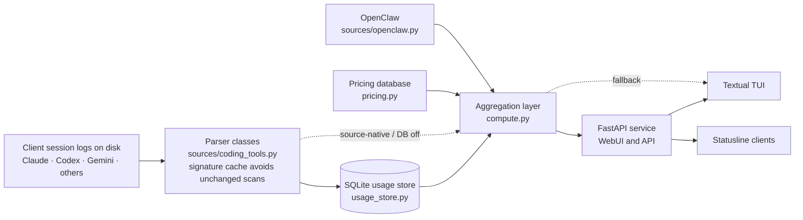

# Architecture and data flow

Tokdash reads local coding-tool activity, stores normalized usage for efficient queries, and presents it through its web and terminal interfaces.

## End-to-end usage flow

## Layers

**Local sources and parsers.** Client applications write session and usage records to local files or their own databases. Parser classes in `coding_tools.py` discover supported formats, normalize usage into entries, and cache file signatures so unchanged inputs do not need to be reparsed on every request. Some parsers are source-native (queried live by `compute.py` on every request), and OpenClaw goes through `sources/openclaw.py` directly. When the usage DB is off or fails, `compute.py` falls back to live parsers.

**Persistent usage store.** `usage_store.py` maintains Tokdash's local SQLite database, including normalized usage entries and source metadata. It synchronizes changed source files and provides indexed queries and aggregation primitives to downstream consumers.

**Pricing.** `pricing.py` and `PricingDatabase` resolve model IDs to per-token rates. Costs are a core output of every view. Most are priced from the pricing database; a few sources keep the cost their client recorded.

**Aggregation.** `compute.py` coordinates parser synchronization, combines stored and source-native data where needed, and calculates date-range usage, costs, and summaries. Its results are the shared data layer used by the presentation surfaces.

**Presentation.** `api.py` exposes usage and quota data through FastAPI routes and serves the WebUI. The Textual TUI first asks a running `tokdash serve` of the same version over HTTP, and only falls back to in-process functions when that fails (`tui/data.py`, `tui/remote.py`). Statusline integrations call `GET /api/usage` for compact usage data.

## Quota polling subsystem

Quota tracking runs alongside usage aggregation and stores time-stamped quota snapshots in the same local SQLite usage database. When enabled by the master switch, the poller gathers Codex session-derived quota locally and, with credential-scan consent and provider-specific network consent, reads disclosed local CLI credentials and requests quota from supported providers. The daemon schedules ordinary polls with jitter and can add provider-scoped samples before and after fixed reset boundaries. The WebUI and TUI can trigger manual refreshes via `/api/quota/refresh` and the TUI's `u` key. See [`QUOTA.md`](../reference/QUOTA.md) for the full quota polling design.
