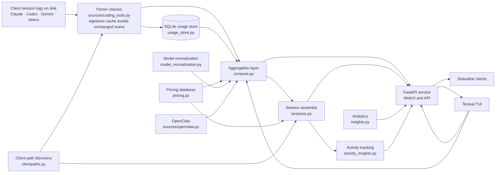

# Architecture and data flow

Tokdash reads local coding-tool activity, stores normalized usage for efficient queries, and presents it through its web and terminal interfaces.

## Module map

```mermaid
flowchart TB
    subgraph Entry
        Main["__main__.py"]
        CLI["cli.py"]
        CLIHelp["cli_help.py"]
        OSInfo["osinfo.py"]
        DevFixtures["dev_fixtures.py"]
    end

    subgraph API["API layer"]
        API["api.py (FastAPI)"]
        Assets["assets.py"]
        InstanceID["instance_identity.py"]
    end

    subgraph Compute["Compute layer"]
        Compute["compute.py"]
        Sessions["sessions.py"]
        Insights["insights.py"]
        ActivityInsights["activity_insights.py"]
    end

    subgraph Store["Store layer"]
        UsageStore["usage_store.py"]
        StoreLogging["store_logging.py"]
        FileLock["filelock.py"]
    end

    subgraph Pricing["Pricing layer"]
        Pricing["pricing.py"]
        ModelNorm["model_normalization.py"]
    end

    subgraph Sources["Sources layer"]
        CodingTools["coding_tools.py"]
        OpenClaw["openclaw.py"]
        DSHLog["dsh_log.py"]
        PiForks["pi_forks.py"]
        ClientPaths["clientpaths.py"]
    end

    subgraph Quota["Quota layer"]
        QuotaInit["quota/__init__.py"]
        QuotaConfig["quota/config.py"]
        QuotaTypes["quota/types.py"]
        CredSources["quota/credential_sources.py"]
        CodexQ["quota/codex.py"]
        ClaudeQ["quota/claude.py"]
        AntigravityQ["quota/antigravity.py"]
        GrokQ["quota/grok.py"]
        KimiQ["quota/kimi.py"]
        MinimaxQ["quota/minimax.py"]
        ZaiQ["quota/zai.py"]
        OpencodeGoQ["quota/opencode_go.py"]
        CommandCodeQ["quota/commandcode.py"]
        CodexWindows["codex_quota_windows.py"]
    end

    subgraph TUI["TUI layer"]
        TUIApp["tui/app.py"]
        TUIData["tui/data.py"]
        TUIRemote["tui/remote.py"]
        TUICharts["tui/charts.py"]
        TUIFormat["tui/formatting.py"]
        TUIReport["tui/report.py"]
    end

    subgraph Onboard["Onboarding layer"]
        OnboardEngine["onboard/engine.py"]
        OnboardDetect["onboard/detect.py"]
        OnboardPlan["onboard/plan.py"]
        OnboardPaths["onboard/paths.py"]
        OnboardUpdate["onboard/updatecheck.py"]
        OnboardUpdateAuth["onboard/update_auth.py"]
        OnboardUpdateControl["onboard/update_control.py"]
        OnboardUpdateJobs["onboard/update_jobs.py"]
        OnboardUpdateMech["onboard/update_mechanics.py"]
        OnboardService["onboard/service_base.py"]
        OnboardSystemd["onboard/systemd.py"]
        OnboardLaunchd["onboard/launchd.py"]
        OnboardWinsched["onboard/winsched.py"]
        OnboardTailscale["onboard/tailscale.py"]
        OnboardManifest["onboard/manifest.py"]
        OnboardRuntime["onboard/runtime.py"]
        OnboardUpdateHelper["onboard/update_helper.py"]
        OnboardUpdateElig["onboard/update_eligibility.py"]
    end

    subgraph Utils["Utilities"]
        DateUtil["dateutil.py"]
    end

    Main --> CLI
    CLI --> API
    CLI --> OnboardEngine
    CLI --> OSInfo
    CLI --> CLIHelp

    API --> Compute
    API --> Sessions
    API --> Insights
    API --> Assets
    API --> InstanceID
    API --> QuotaInit
    API --> DateUtil
    API --> DevFixtures

    Compute --> UsageStore
    Compute --> Pricing
    Compute --> ModelNorm
    Compute --> CodingTools
    Compute --> OpenClaw
    Compute --> StoreLogging
    Compute --> DateUtil

    Sessions --> ActivityInsights
    Sessions --> UsageStore
    Sessions --> Pricing
    Sessions --> CodingTools
    Sessions --> ClientPaths
    Sessions --> Compute

    Insights --> Compute
    Insights --> UsageStore
    Insights --> CodingTools

    UsageStore --> FileLock
    UsageStore --> Pricing

    CodingTools --> ClientPaths
    CodingTools --> DSHLog
    CodingTools --> PiForks

    QuotaInit --> QuotaConfig
    QuotaInit --> QuotaTypes
    QuotaInit --> CredSources
    QuotaInit --> CodexQ
    QuotaInit --> ClaudeQ
    QuotaInit --> AntigravityQ
    QuotaInit --> GrokQ
    QuotaInit --> KimiQ
    QuotaInit --> MinimaxQ
    QuotaInit --> ZaiQ
    QuotaInit --> OpencodeGoQ
    QuotaInit --> CommandCodeQ
    QuotaInit --> UsageStore
    QuotaInit --> ClientPaths

    CodexQ --> CodexWindows

    TUIApp --> TUIData
    TUIApp --> TUICharts
    TUIApp --> TUIFormat
    TUIApp --> TUIReport
    TUIData --> TUIRemote
    TUIData --> API
    TUIData --> Compute
    TUIData --> Insights
    TUIData --> UsageStore
    TUIData --> QuotaInit
    TUIRemote --> API
    TUIRemote --> OnboardEngine
    TUIRemote --> OnboardManifest
    TUIRemote --> OnboardPlan

    OnboardEngine --> OnboardDetect
    OnboardEngine --> OnboardPlan
    OnboardEngine --> OnboardPaths
    OnboardEngine --> OnboardUpdate
    OnboardEngine --> OnboardUpdateAuth
    OnboardEngine --> OnboardUpdateJobs
    OnboardEngine --> OnboardUpdateMech
    OnboardEngine --> OnboardSystemd
    OnboardEngine --> OnboardLaunchd
    OnboardEngine --> OnboardWinsched
    OnboardEngine --> OnboardTailscale
    OnboardEngine --> OnboardManifest
    OnboardEngine --> OnboardRuntime

    OnboardService --> OnboardSystemd
    OnboardService --> OnboardLaunchd
    OnboardService --> OnboardWinsched

    OnboardUpdateControl --> OnboardUpdateHelper
    OnboardUpdateControl --> OnboardUpdateElig
    OnboardUpdateControl --> OnboardManifest
    OnboardUpdateControl --> OnboardUpdateAuth
    OnboardUpdateControl --> OnboardUpdateJobs
    OnboardUpdateControl --> OnboardUpdateMech
    OnboardUpdateControl --> OnboardUpdate
```

## End-to-end usage flow



## Layers

**Entry point.** `__main__.py` delegates to `cli.py`, which parses arguments and dispatches to the appropriate command. The CLI imports `api.py` (the FastAPI app), `onboard/engine.py` (the onboarding lifecycle), `osinfo.py` (OS detection), and `cli_help.py` (brief help text). `dev_fixtures.py` is used by `api.py` for fixture mode, not by the CLI directly.

**API layer.** `api.py` is the FastAPI application. It imports from `compute.py`, `sessions.py`, `insights.py`, `usage_store.py`, `assets.py`, `instance_identity.py`, `dateutil.py`, and the quota subsystem (lazily). It serves the WebUI static files, handles CORS, and exposes REST endpoints for usage, sessions, insights, activity insights, and quota data. Activity insights are obtained through `sessions.py` (`get_codex_activity_insights`), not by importing `activity_insights.py` directly.

**Compute layer.** `compute.py` coordinates parser synchronization, combines stored and source-native data, and calculates date-range usage, costs, and summaries. It imports from `usage_store.py`, `pricing.py`, `model_normalization.py`, `coding_tools.py`, `openclaw.py`, `store_logging.py`, and `dateutil.py`. `sessions.py` is a major layer between store and API, handling session assembly, deduplication, and caching. It imports from `activity_insights.py`, `usage_store.py`, `pricing.py`, `coding_tools.py`, `clientpaths.py`, and `compute.py`. `insights.py` provides fine-grained analytics (hourly, weekday, heatmap, models, tools, streaks) and imports from `compute.py`, `usage_store.py`, and `coding_tools.py`. `activity_insights.py` tracks reasoning turns and tool calls and is imported by `sessions.py`.

**Store layer.** `usage_store.py` maintains the local SQLite database, including normalized usage entries and source metadata. It synchronizes changed source files and provides indexed queries and aggregation primitives. It imports from `filelock.py` and `pricing.py`. `store_logging.py` provides a policy for reporting failed store reads (once per process, loudly, then quietly). `filelock.py` provides cross-platform file locking.

**Pricing layer.** `pricing.py` and `PricingDatabase` resolve model IDs to per-token rates. `model_normalization.py` normalizes model names before pricing lookup, handling provider prefixes, vendor prefixes, release suffixes, and alias maps.

**Sources layer.** `coding_tools.py` contains parser classes that discover supported formats, normalize usage into entries, and cache file signatures. It imports from `clientpaths.py`, `dsh_log.py`, and `pi_forks.py`. `openclaw.py` handles OpenClaw session files. `dsh_log.py` handles DSH (DeepSeek Harness) log files. `pi_forks.py` handles Pi fork contexts. `clientpaths.py` discovers client install paths for Claude, Codex, OpenCode, and other tools.

**Quota layer.** The quota subsystem lives in `sources/quota/`. `quota/__init__.py` provides the main polling logic (`poll_quota`, `collect_local_snapshots`, `collect_network_snapshots`). It imports from `config.py`, `types.py`, `credential_sources.py`, `usage_store.py`, `clientpaths.py`, and all per-provider collectors. `quota/config.py` handles consent and enabled sources. `quota/types.py` defines `QuotaSnapshot`. `quota/credential_sources.py` discovers and validates credentials and endpoints (makes no network calls). The per-provider collectors (`codex.py`, `claude.py`, `antigravity.py`, `grok.py`, `kimi.py`, `minimax.py`, `zai.py`, `opencode_go.py`, `commandcode.py`) make the actual HTTP requests to provider APIs. Only `kimi.py`, `minimax.py`, and `zai.py` import `credential_sources.py` directly; the others receive credentials through `quota/__init__.py`. `codex_quota_windows.py` provides Codex quota window classification.

**TUI layer.** The Textual TUI lives in `tui/`. `tui/app.py` is the main application. `tui/data.py` fetches data from the API or compute layer. `tui/remote.py` handles remote server communication. `tui/charts.py`, `tui/formatting.py`, and `tui/report.py` handle display. The TUI first asks a running `tokdash serve` of the same version over HTTP, and only falls back to in-process functions when that fails.

**Onboarding layer.** The `onboard/` package handles first-run setup, service installation, and updates. `onboard/engine.py` is the main entry point (detect → plan → apply → record → revert). It imports `detect.py`, `plan.py`, `paths.py`, `updatecheck.py`, `update_auth.py` (lazily), `update_jobs.py`, `update_mechanics.py`, `systemd.py`, `launchd.py`, `winsched.py`, `tailscale.py`, `manifest.py`, and `runtime.py`. `onboard/service_base.py` provides the base for service installation and imports `systemd.py`, `launchd.py`, and `winsched.py`. `onboard/update_control.py` handles update control and imports `update_helper.py`, `update_eligibility.py`, `manifest.py`, `update_auth.py`, `update_jobs.py`, `update_mechanics.py`, and `updatecheck.py`. `onboard/updatecheck.py` is a standalone module that queries PyPI and imports only `paths.py`.

**Utilities.** `dateutil.py` provides date range parsing and local midnight calculation. It is imported by `compute.py`, `api.py`, `sessions.py`, and `insights.py`.

## Quota polling subsystem

Quota tracking runs alongside usage aggregation and stores time-stamped quota snapshots in the same local SQLite usage database. When enabled by the master switch, the poller gathers Codex session-derived quota locally and, with credential-scan consent and provider-specific network consent, reads disclosed local CLI credentials and requests quota from supported providers. The daemon schedules ordinary polls with jitter and can add provider-scoped samples before and after fixed reset boundaries. The WebUI and TUI can trigger manual refreshes via `/api/quota/refresh` and the TUI's `u` key. See [`QUOTA.md`](../reference/QUOTA.md) for the full quota polling design.
