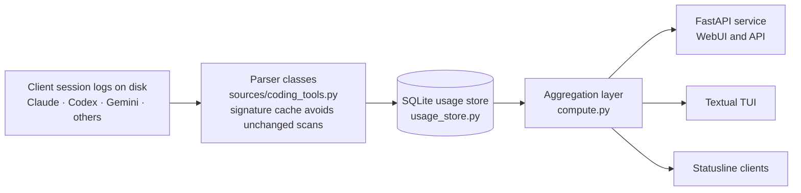

# Architecture and data flow

Tokdash reads local coding-tool activity, stores normalized usage for efficient queries, and presents it through its web and terminal interfaces.

## End-to-end usage flow

## Layers

**Local sources and parsers.** Client applications write session and usage records to local files or their own databases. Parser classes in `coding_tools.py` discover supported formats, normalize usage into entries, and cache file signatures so unchanged inputs do not need to be reparsed on every request.

**Persistent usage store.** `usage_store.py` maintains Tokdash's local SQLite database, including normalized usage entries and source metadata. It synchronizes changed source files and provides indexed queries and aggregation primitives to downstream consumers.

**Aggregation.** `compute.py` coordinates parser synchronization, combines stored and source-native data where needed, and calculates date-range usage, costs, and summaries. Its results are the shared data layer used by the presentation surfaces.

**Presentation.** `api.py` exposes usage and quota data through FastAPI routes and serves the WebUI. The Textual TUI uses the same in-process data functions for its dashboard, while statusline integrations read compact usage data through Tokdash's local interfaces.

## Quota polling subsystem

Quota tracking runs alongside usage aggregation and stores time-stamped quota snapshots in the same local SQLite usage database. The poller gathers Codex session-derived quota locally and, when enabled by the master switch, credential-scan consent, and provider-specific network consent, reads disclosed local CLI credentials and requests quota from supported providers. The daemon schedules ordinary polls with jitter and can add provider-scoped samples before and after fixed reset boundaries; the WebUI and TUI read the resulting current state and history without owning the background polling loop.
